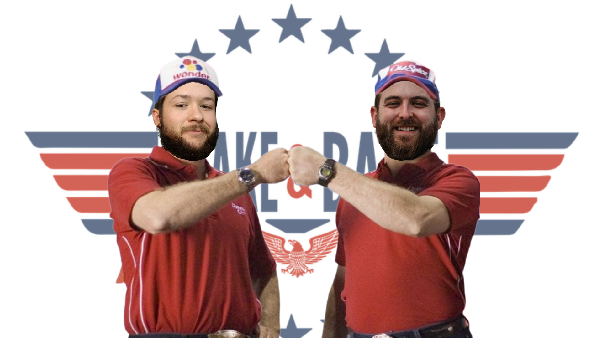
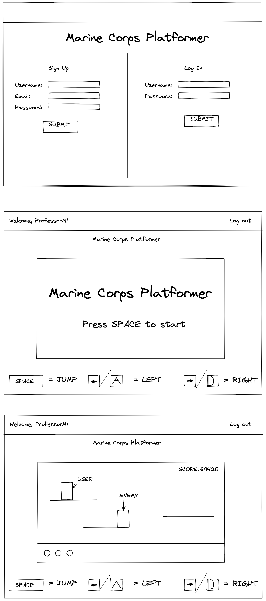

<h1 align="center">Semper Skate</h1>

Hello! Welcome to Semper Skate! This game was created by <a href="https://github.com/jakeschultz89">Jake Schultz</a> and <a href="https://github.com/shanedixon13">Shane Dixon</a>, also known together as "Shake&Bake", as part of our capstone project.

<a href="https://github.com/jakeschultz89/python-game.git">Semper Skate Repo Link</a>

Semper Skate is a side-scrolling platform video game built using Pygame in which the player is a Junior Enlisted Marine and must make it safely back to their barracks room without getting caught by their Senior Enlisted and forced to go on Duty. Throughout the game the player will collect every Marine's favorite snack, Crayola Crayons, as they traverse the levels. The player will also have the ability to leap onto the ever-infamous Ford Mustangs that all Junior Marines buy at a cheap 29% interest rate throughout the levels.

To play Semper Skate you will need to download a copy of this repository and install Pygame through the "pip3 install pygame" command in your terminal. Once that is complete simply click on the "main.py" file and run the file.

The controls for the game are very simple: Press SPACE to enter the first level. Once inside the level you can press the left arrow or A key to go left and the right arrow or D key to go right as well as using SPACE to jump. Be sure to jump over or on top of the enemies so you do not take damage and have to restart. The level ends when the player makes it to the finish line.

Stretch Goals

<ul>
<li>Custom Graphics</li>
<li>More Defined Storyline</li>
<li>Power-Ups</li>
<li>More Levels</li>
<li>Published to Steam</li>
<li>& More!</li>
</ul>

Built with

<ul>
<li>Python</li>
<li>Pygame</li>
</ul>

Initial Wireframes

